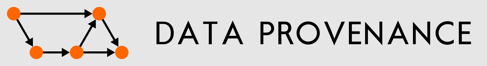
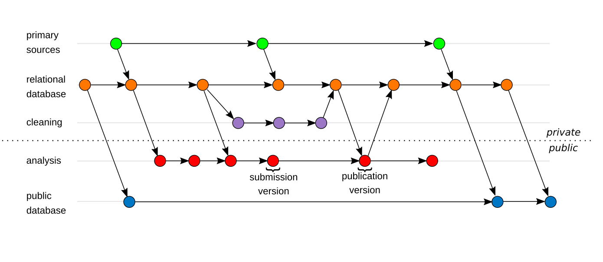
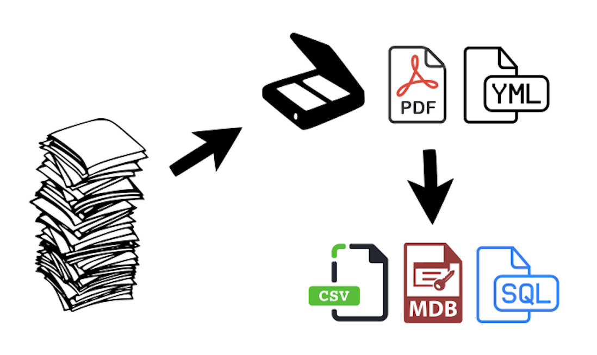
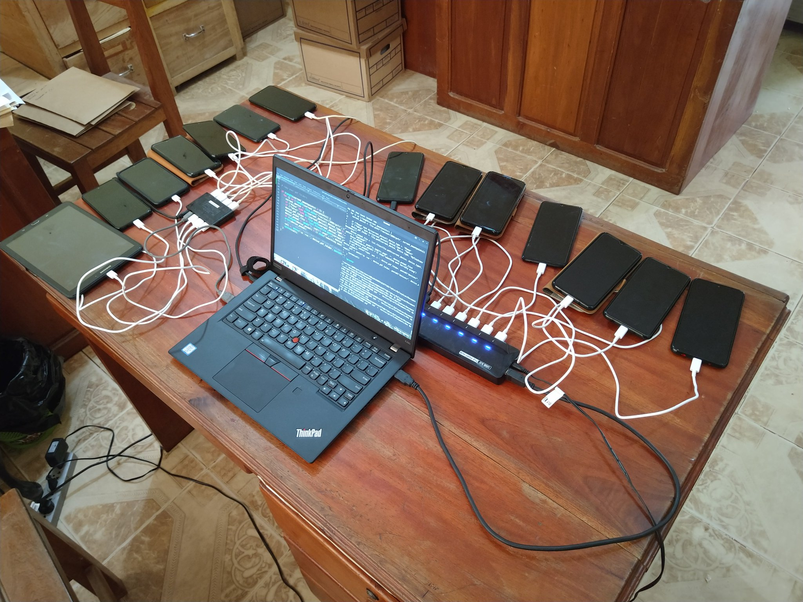

Our group organizes computational and database support for department fieldsites worldwide, using standardized, scripted data processing and formal version control to keep clear records of the history of each individual data point.

# Database Design

Organizing large-scale, longitudinal field data is a difficult task, but can be made much easier with recent advancements in software automation. Our research group is focused on providing support for multi-site, integrated long-form databasing. The databases maintained by the Data Provenance Research Group including work in Nicaragua, India, Japan, Tanzania, and Mongolia. Most notably, we maintain the Tsimane Health and Life History Project database, which integrates economic and social interviews with biomedicine. Together with Daniel Redhead we have also developed the ENDOW project database, an explicitly longitudinal study of multi-site social networks.

# Field Data Processing

In addition to databasing, our team is also involved with processing data as it is collected in the field. Primarily this involves digital transcription from paper to PDF to plaintext, routinized using the ecodata and yamltools R packages to allow high-throughput with automatic quality control.

Our work also involves audio transcription of recorded interviews and documentary film footage with videographer Karl Frost.

# Rescuing Long-Term Field Data

Advances in data capture technology have enabled us to rapidly archive hundreds of thousands of pages of data collected in long-term field projects using smartphone scanning apps, preserving the original records of irreplaceable anthropological observations. Our team integrates these scans into existing databases of transcribed, processed data, allowing researchers to reconstruct the provenance of resulting database queries.

# Team

## Group Leaders

- Bret Beheim, Ph.D.
- Silke Atmaca, Ph.D.

## Scientific Staff

- Claudia Bavero
- Sophie Kaube

## Student Assistants

- Anastassiya Bublikova
- Anja Becker
- Anne Büchner
- Antje Winkler
- Klara Unger
- Philine Adolphi
- Vincent Kiepsch
